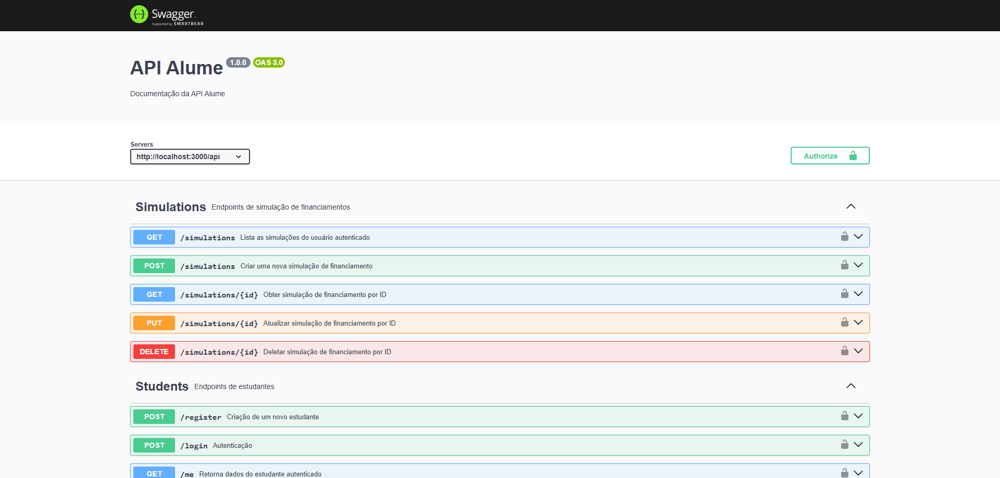
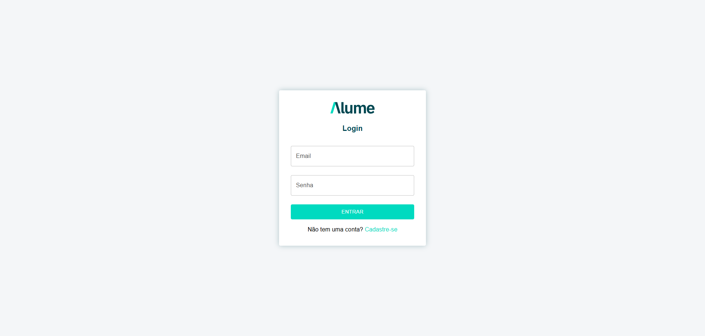
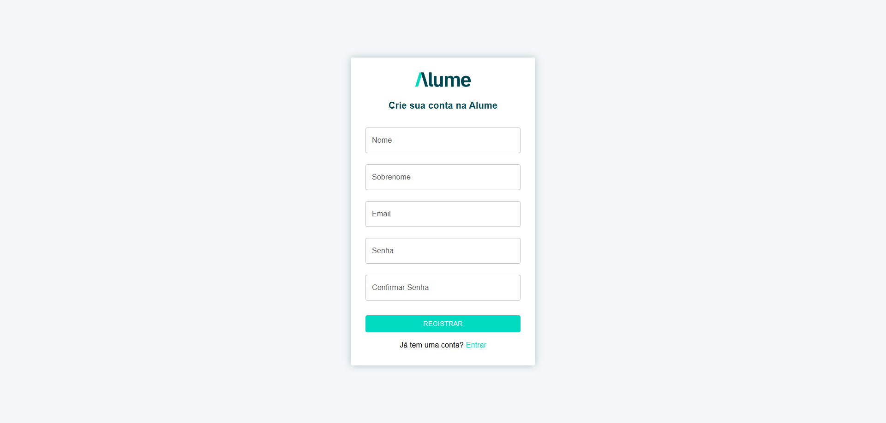

# Projeto Alume

- **Banco de Dados** (MySQL via Docker-compose)
- **API** (Node.js com TypeScript)
- **APP (Frontend)** (React + Typescript)

---

## 🗄️ Banco de Dados

- Atualize o arquivo `docker-compose.yml` na raiz do projeto, se necessário, com as configurações desejadas.
- Suba o container com o banco de dados, executando o comando abaixo na raiz do projeto:

```bash
docker-compose up -d
```

---

## ⚙️ API

### Tecnologias utilizadas

- **TypeScript**
- **Sequelize**
- **bcrypt**
- **joi**

### Configuração

1. Copie o arquivo `.env.example` e renomeie para `.env`:

```bash
cp .env.example .env
```

2. Atualize as variáveis de ambiente conforme necessário.

### Inicialização

1. Instale as dependências:

```bash
npm install
```

2. Execute as migrações e inicie o servidor:

```bash
npm run dev
```

OBS.: caso o campo **'ENVIRONMENT'** do arquivo .env esteja como **'development'**, você poderá ver a documentação Swagger no endereço:

```bash
http://localhost:{porta}/swagger # por padrão a aplicação estará na porta 3000
```
Caso esteja **'production'**, a documentação não estará mais disponível.

### Regras de Autenticação
Todas as rotas da API são protegidas *(com exceção de '/login' e '/register')* e requerem um token JWT do tipo Bearer no cabeçalho da requisição. Esse token é fornecido após o login e possui validade de **5 minutos**.

Exemplo de uso no cabeçalho:

```bash
Authorization: Bearer <seu_token_jwt>
```

Caso o token esteja ausente, inválido ou expirado, a API retornará um erro de autenticação (401 Unauthorized ou 403 Forbidden).

---

## 💻 APP (Frontend)

### Tecnologias utilizadas

- **React + Vite**
- **TypeScript**
- **Context API**
- **Material UI (MUI)**
- **React Hook Form**
- **Yup**
- **Chart.js**

### Configuração

1. Copie o arquivo `.env.example` dentro da pasta do app e renomeie para `.env`:

```bash
cp .env.example .env
```

2. Atualize as variáveis conforme necessário.

### Inicialização

1. Instale as dependências:

```bash
npm install
```

2. Inicie a aplicação:

```bash
npm run dev
```

3. Acesse a aplicação:

```bash
http://localhost:{porta} # por padrão a aplicação estará na porta 5173
```

---

## 🔍 Observações

- Certifique-se de que as portas utilizadas tanto pela API quanto pelo banco de dados no `docker-compose.yml` não estejam em uso por outros serviços.
- A API e o APP devem rodar em ambientes separados (diferentes terminais ou abas do terminal).
- Ao alterar variáveis de ambiente, reinicie os servidores da API e do APP para aplicar as mudanças.

---

## 📸 Screenshots

### Documentação Swagger


### Login


### Registro


### Funcionamento


